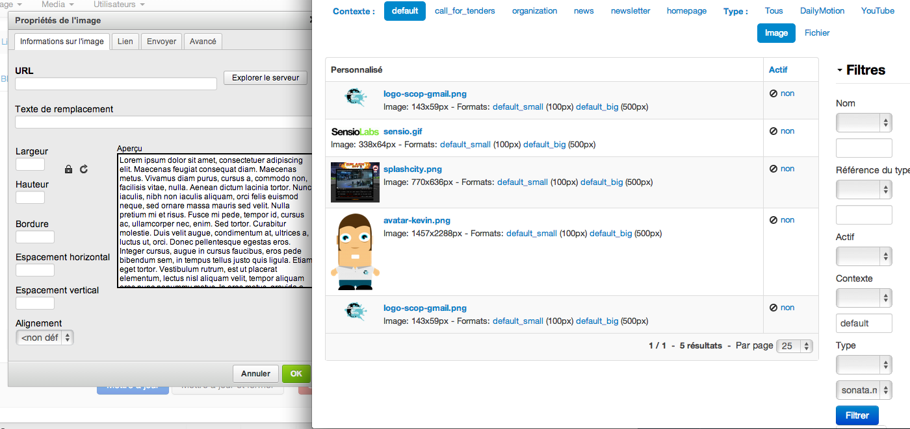

# Sonata Media CKEditor integration

The bundle provides [SonataMediaBundle](http://sonata-project.org/bundles/media/master/doc/index.html) integration into [CKEditor](http://ckeditor.com/) for Symfony 2 projects.

## Features

* Browse files and images managed with SonataMediaBundle directly from the CKEditor UI
* Filter and order
* Upload files and images to SonataMediaBundle directly form the CKEditor UI

## Doc

1. [Installation](Resources/doc/install.md)
2. [Architecture](Resources/doc/architecture.md)
3. [Full configuration options](Resources/doc/configuration.md)

## TODO

* Create Behat tests

## Credits

Created by [Kévin Dunglas](http://dunglas.fr) for [Les-Tilleuls.coop](http://les-tilleuls.coop).

