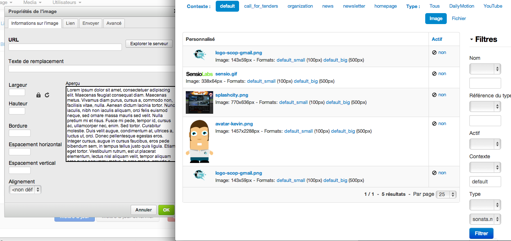

# Sonata Media CKEditor Integration

The bundle provides [SonataMediaBundle](https://sonata-project.org/bundles/media/master/doc/index.html) integration into [CKEditor](http://ckeditor.com/) for Symfony projects.

## Features

* Browse files and images managed with SonataMediaBundle directly from the CKEditor UI
* Filter and order
* Upload files and images to SonataMediaBundle directly form the CKEditor UI

## Docs

1. [Installation](docs/install.md)
2. [Architecture](docs/architecture.md)
3. [Full configuration options](docs/configuration.md)

## Credits

Created by [Kévin Dunglas](https://dunglas.fr) for [Les-Tilleuls.coop](https://les-tilleuls.coop).

